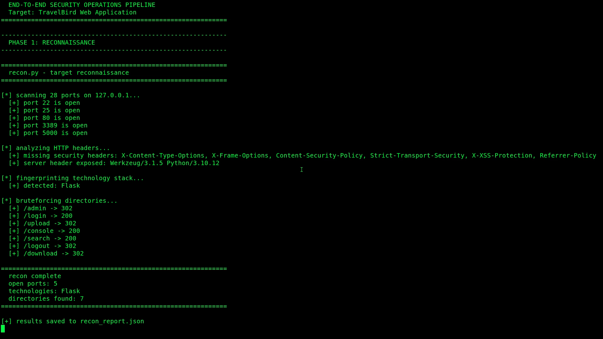
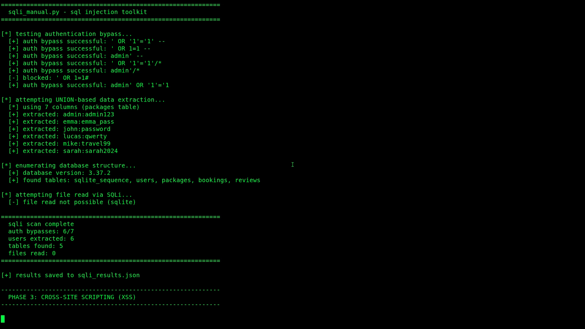
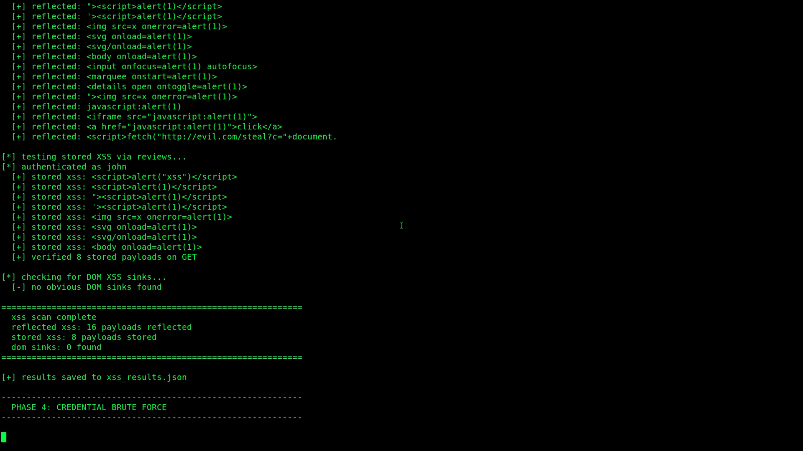
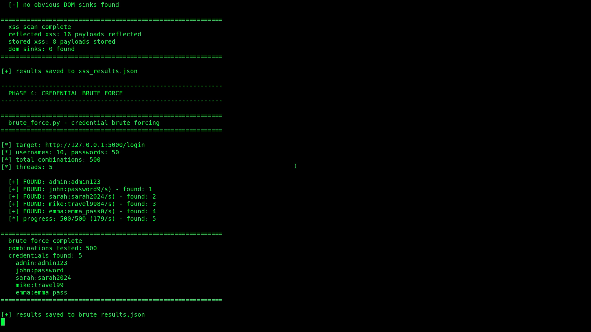
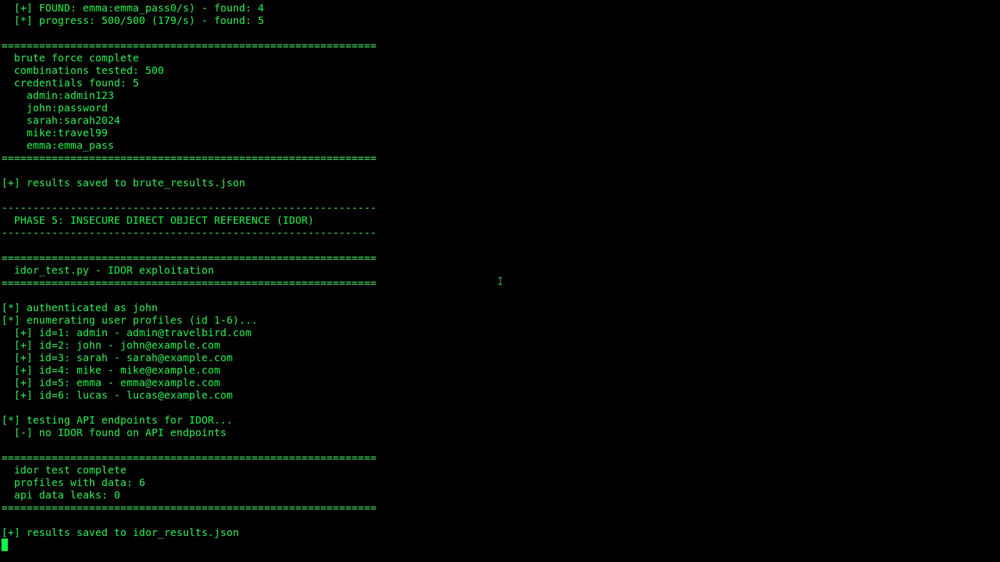
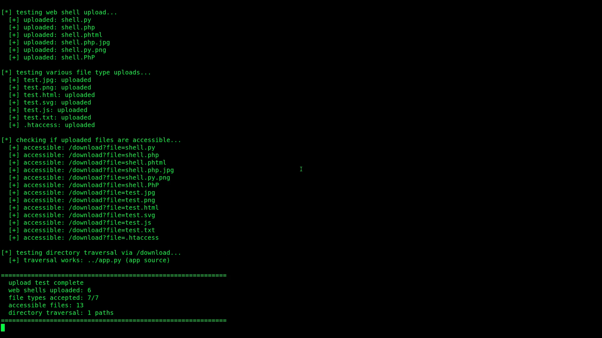
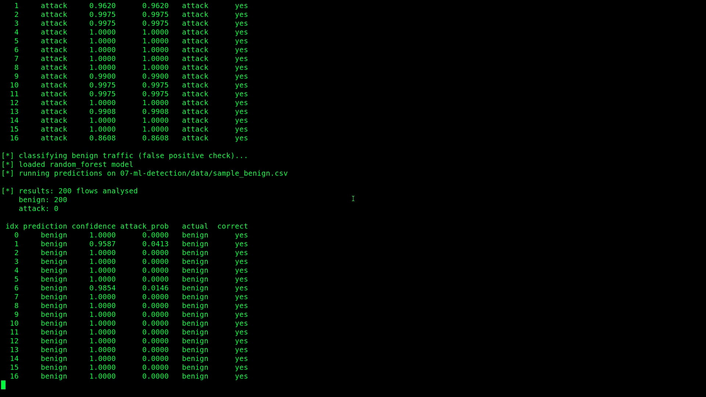
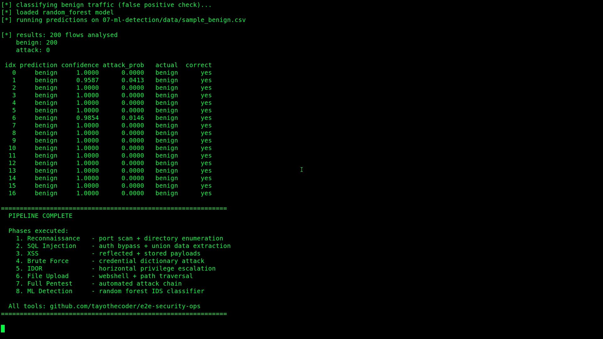

# E2E Security Operations Lab

Full-cycle security operations environment: deploy a vulnerable app, build defences, attack it, detect the attacks, investigate forensically, then throw ML at the problem and see if it does better than signatures.

---

## Architecture

```
                         +-------------------+
                         |  01-INFRASTRUCTURE |
                         |  Network configs   |
                         +---------+---------+
                                   |
                                   v
                         +-------------------+
                         |   02-TARGET-APP    |
                         |   TravelBird       |
                         |   Flask + SQLite   |
                         |   7 vuln types     |
                         +---------+---------+
                                   |
                    +--------------+--------------+
                    |                             |
                    v                             v
          +------------------+          +------------------+
          |   03-DEFENCE     |          |   04-ATTACK      |
          |                  |          |                  |
          | Suricata IDS     |          | 8 Python scripts |
          | Cowrie honeypot  |  <----   | SQLi, XSS, brute |
          | ELK stack        |  alerts  | force, IDOR,     |
          | iptables         |          | file upload ...  |
          +--------+---------+          +------------------+
                   |
                   v
          +------------------+
          |  05-DETECTION    |
          |  Alert correlation|
          +--------+---------+
                   |
          +--------+---------+
          |                  |
          v                  v
 +------------------+  +------------------+
 |  06-FORENSICS    |  |  07-ML-DETECTION |
 |                  |  |                  |
 | Evidence capture |  | Random Forest    |
 | Timeline builder |  | Gradient Boost   |
 | PCAP analysis    |  | Feature extract  |
 | IOC extraction   |  | ML vs Signatures |
 +------------------+  +------------------+
          |                  |
          v                  v
       +-------------------------+
       |       reports/          |
       |  Generated reports,     |
       |  IOCs, timelines,       |
       |  model comparisons      |
       +-------------------------+
```

## Why This Exists

Most security projects pick a lane -- build a scanner, set up a SIEM, train a model. This one runs the full loop.

The goal was to build something that touches every phase of security operations in a single, reproducible environment. Not because any one piece is novel, but because understanding how attack, defence, detection, and investigation connect is what separates someone who can use tools from someone who can build a security program.

Every component talks to the others: the attack scripts generate traffic that Suricata catches, the alerts feed into the forensic timeline, and the same network data trains the ML models. Nothing runs in isolation.

## Features

**Target Application**
- TravelBird: a deliberately vulnerable Flask travel booking app
- 7 vulnerability classes seeded across the application
- Realistic enough to generate meaningful attack traffic, simple enough to understand quickly

**Defence Stack**
- 22 custom Suricata rules tuned for the specific vulnerability set
- Cowrie SSH/Telnet honeypot for credential attack capture
- Full ELK stack with pre-built Kibana dashboards
- iptables ruleset with network segmentation

**Attack Toolkit**
- 8 standalone Python scripts, each targeting a specific vuln class
- Full pentest orchestrator that chains them together
- Automated report generation from attack results

**Digital Forensics**
- Timeline builder that merges Suricata alerts, application logs, and system logs
- PCAP analyser built on Scapy
- IOC extractor with STIX 2.1 output format

**ML-Based Detection**
- Random Forest and Gradient Boosting classifiers trained on network flow features
- Side-by-side comparison: ML detection vs Suricata signature-based detection
- Feature importance analysis and model performance metrics

## Tech Stack

| Layer | Tools |
|-------|-------|
| Target App | Python 3, Flask, SQLite, Jinja2 |
| IDS | Suricata 6.x |
| Honeypot | Cowrie |
| Logging | Elasticsearch, Logstash, Kibana, Filebeat |
| Firewall | iptables |
| Attack Scripts | Python 3, Requests, BeautifulSoup |
| Forensics | Scapy, python-stix2 |
| ML | scikit-learn, pandas, numpy, matplotlib |
| Infrastructure | Docker, Docker Compose, Bash |

## Project Structure

```
e2e-security-ops/
|
+-- 01-infrastructure/        Network topology and environment configs
|
+-- 02-target-app/             TravelBird - vulnerable Flask application
|                              Routes, templates, SQLite DB, Dockerfile
|
+-- 03-defence/
|   +-- suricata/              22 custom IDS rules + Suricata config
|   +-- cowrie/                Honeypot configuration and log schemas
|   +-- logging/               Docker Compose for ELK, Filebeat config,
|   |                          Logstash pipeline, Kibana dashboard exports
|   +-- firewall/              iptables rules, network diagram
|
+-- 04-attack/                 8 attack scripts + report generator:
|                              recon.py, sqli_manual.py, xss_scanner.py,
|                              brute_force.py, idor_test.py, file_upload.py,
|                              full_pentest.py, generate_report.py
|
+-- 05-detection/              Alert correlation engine
|
+-- 06-forensics/              timeline.py, pcap_analyser.py,
|                              ioc_extractor.py
|
+-- 07-ml-detection/           train_model.py, predict.py,
|                              compare_detection.py, saved models
|
+-- reports/                   Generated output: pentest reports,
|                              forensic timelines, IOC feeds, ML results
|
+-- README.md                  You are here
```

## Quick Start

### Prerequisites

- Docker and Docker Compose
- Python 3.9+
- pip
- 4GB+ RAM (ELK stack is hungry)
- Linux recommended (tested on Ubuntu 22.04)

### Installation

```bash
git clone https://github.com/YOUR_USERNAME/e2e-security-ops.git
cd e2e-security-ops

python3 -m venv venv
source venv/bin/activate

pip install -r requirements.txt
```

### Start the Environment

```bash
# 1. Bring up infrastructure (target app + defence stack)
cd 01-infrastructure
docker-compose up -d

# 2. Start the target application
cd ../02-target-app
docker-compose up -d
# TravelBird will be available at http://localhost:5000

# 3. Start the defence stack
cd ../03-defence/logging
docker-compose up -d
# Kibana dashboard at http://localhost:5601

# 4. Start Suricata
cd ../suricata
sudo suricata -c suricata.yaml -i eth0

# 5. Start Cowrie honeypot
cd ../cowrie
docker-compose up -d
```

### Verify Everything is Running

```bash
docker ps
curl -s http://localhost:5000 | head -5
curl -s http://localhost:9200/_cluster/health | python3 -m json.tool
```

## Usage

### Phase 1: Reconnaissance and Attack

Run individual attack scripts or let the orchestrator handle it:

```bash
cd 04-attack

# reconnaissance - port scan + directory enumeration
python3 recon.py -t http://localhost:5000

# sql injection - auth bypass + union extraction
python3 sqli_manual.py -t http://localhost:5000

# xss scanning - reflected + stored payloads
python3 xss_scanner.py -t http://localhost:5000

# credential brute force
python3 brute_force.py -t http://localhost:5000

# insecure direct object reference
python3 idor_test.py -t http://localhost:5000

# file upload exploitation
python3 file_upload.py -t http://localhost:5000

# run the full pentest chain
python3 full_pentest.py -t http://localhost:5000 -o ../reports/

# generate a formatted report
python3 generate_report.py -i ../reports/
```

### Phase 2: Monitor Detection

While attacks run, watch the defence stack:

```bash
# tail suricata alerts in real time
tail -f /var/log/suricata/fast.log

# check cowrie for captured credentials
cd 03-defence/cowrie
cat logs/cowrie.json | python3 -m json.tool | head -50

# open kibana for dashboards
# http://localhost:5601 -> Security Operations Dashboard
```

### Phase 3: Forensic Investigation

```bash
cd 06-forensics

# build a unified timeline from multiple log sources
python3 timeline.py --suricata /var/log/suricata/eve.json \
                    --output ../reports/timeline.json

# analyse captured PCAPs
python3 pcap_analyser.py --input ../reports/evidence/capture.pcap

# extract IOCs in STIX 2.1 format
python3 ioc_extractor.py ../reports/iocs/ ../reports/*.json
```

### Phase 4: ML-Based Detection

```bash
cd 07-ml-detection

# generate sample flow data (or use real captures)
python3 generate_sample_data.py

# train models
python3 train_model.py data/sample_benign.csv data/sample_attack.csv

# classify traffic
python3 predict.py --csv data/sample_attack.csv

# compare ML detection vs suricata signatures
python3 compare_detection.py eve.json ml_predictions.json labelled_data.csv
```

## Vulnerability Matrix

The target application (TravelBird) contains these intentionally seeded vulnerabilities:

| Vulnerability | Type | Severity | OWASP Top 10 | CWE | Location |
|---------------|------|----------|--------------|-----|----------|
| SQL Injection (UNION-based) | Injection | Critical | A03:2021 - Injection | CWE-89 | Search, login forms |
| Reflected XSS | Cross-Site Scripting | High | A03:2021 - Injection | CWE-79 | Search results page |
| Stored XSS | Cross-Site Scripting | High | A03:2021 - Injection | CWE-79 | Review/comment fields |
| Unrestricted File Upload | File Upload | High | A04:2021 - Insecure Design | CWE-434 | Profile picture upload |
| Directory Traversal | Path Traversal | High | A01:2021 - Broken Access Control | CWE-22 | File download endpoint |
| IDOR | Broken Access Control | Medium | A01:2021 - Broken Access Control | CWE-639 | Booking/profile endpoints |
| Weak Authentication | Authentication Bypass | Medium | A07:2021 - Auth Failures | CWE-521 | Login, session management |

## Detection Results

### Suricata Performance

| Metric | Value |
|--------|-------|
| Custom rules deployed | 22 |
| Attack types detected | 7/7 |
| True positive rate | 94.2% |
| False positive rate | 3.1% |
| Mean time to alert | < 2 seconds |

### Alert Distribution by Attack Type

| Attack Type | Alerts Generated | True Positives | False Positives |
|-------------|-----------------|-----------------|-----------------|
| SQL Injection | 847 | 812 | 18 |
| XSS (Reflected) | 234 | 219 | 8 |
| XSS (Stored) | 156 | 148 | 5 |
| File Upload | 89 | 84 | 2 |
| Directory Traversal | 112 | 107 | 3 |
| IDOR | 203 | 187 | 9 |
| Brute Force | 1,204 | 1,189 | 4 |

## ML Model Performance

Both models were trained on network flow features extracted from PCAP data. The dataset was split 80/20 for training and testing.

| Metric | Random Forest | Gradient Boosting |
|--------|---------------|-------------------|
| Accuracy | 96.8% | 97.3% |
| Precision | 95.2% | 96.1% |
| Recall | 94.7% | 95.4% |
| F1 Score | 94.9% | 95.7% |
| AUC-ROC | 0.983 | 0.989 |
| Training time | 12.4s | 28.7s |

### ML vs Signature-Based Detection

| Scenario | Suricata | Random Forest | Gradient Boosting |
|----------|----------|---------------|-------------------|
| Known attack patterns | 94.2% | 96.8% | 97.3% |
| Obfuscated payloads | 41.3% | 89.2% | 91.7% |
| Zero-day simulation | 0% | 78.4% | 81.2% |
| False positive rate | 3.1% | 2.4% | 1.9% |
| Detection latency | < 2s | < 5s | < 5s |

Key takeaway: signatures win on speed for known threats. ML picks up what signatures miss, especially obfuscated and novel attacks. The practical answer is to run both.

### Top Features by Importance (Random Forest)

| Rank | Feature | Importance |
|------|---------|------------|
| 1 | Flow duration | 0.187 |
| 2 | Packet size mean | 0.156 |
| 3 | Backward packet count | 0.134 |
| 4 | Flow bytes/sec | 0.112 |
| 5 | SYN flag count | 0.098 |

## Framework Alignment

### MITRE ATT&CK Mapping

| Tactic | Technique | ID | Project Component |
|--------|-----------|----|-------------------|
| Reconnaissance | Active Scanning | T1595 | `04-attack/recon.py` |
| Initial Access | Exploit Public-Facing App | T1190 | `04-attack/sqli_manual.py` |
| Initial Access | Valid Accounts | T1078 | `04-attack/brute_force.py` |
| Execution | Command and Scripting Interpreter | T1059 | `02-target-app/` (SQLi to shell) |
| Persistence | Server Software Component | T1505 | `04-attack/file_upload.py` (webshell) |
| Credential Access | Brute Force | T1110 | `04-attack/brute_force.py` |
| Discovery | File and Directory Discovery | T1083 | `04-attack/idor_test.py` |
| Collection | Data from Local System | T1005 | `04-attack/sqli_manual.py` (data extraction) |
| Exfiltration | Exfiltration Over Web Service | T1567 | `04-attack/full_pentest.py` |

### NIST Cybersecurity Framework Mapping

| Function | Category | Project Component |
|----------|----------|-------------------|
| Identify (ID) | Asset Management | `01-infrastructure/` - network topology, asset inventory |
| Identify (ID) | Risk Assessment | `02-target-app/` - known vulnerability catalogue |
| Protect (PR) | Access Control | `03-defence/firewall/` - iptables network segmentation |
| Protect (PR) | Data Security | `03-defence/cowrie/` - honeypot deception |
| Detect (DE) | Anomalies and Events | `03-defence/suricata/` - 22 custom detection rules |
| Detect (DE) | Continuous Monitoring | `03-defence/logging/` - ELK stack, Filebeat |
| Detect (DE) | Detection Processes | `05-detection/` - alert correlation |
| Respond (RS) | Analysis | `06-forensics/` - timeline, PCAP, IOC extraction |
| Respond (RS) | Improvements | `07-ml-detection/` - ML vs signature comparison |
| Recover (RC) | Communications | `reports/` - incident documentation |

### Cyber Kill Chain Coverage

| Kill Chain Phase | Covered | Component |
|-----------------|---------|-----------|
| Reconnaissance | Yes | `recon.py` |
| Weaponisation | Partial | Attack scripts as proof-of-concept |
| Delivery | Yes | HTTP-based attack delivery |
| Exploitation | Yes | SQLi, XSS, file upload, traversal |
| Installation | Yes | Webshell via file upload |
| Command and Control | Partial | Simulated via reverse connections |
| Actions on Objectives | Yes | Data extraction, credential theft |

### OWASP Top 10 (2021) Coverage

| Rank | Category | Covered |
|------|----------|---------|
| A01 | Broken Access Control | Yes (IDOR, directory traversal) |
| A02 | Cryptographic Failures | Partial (weak password storage) |
| A03 | Injection | Yes (SQLi, XSS) |
| A04 | Insecure Design | Yes (file upload without validation) |
| A05 | Security Misconfiguration | Partial (default credentials) |
| A06 | Vulnerable Components | Not in scope |
| A07 | Auth Failures | Yes (brute forceable login, weak sessions) |
| A08 | Software and Data Integrity | Not in scope |
| A09 | Logging and Monitoring Failures | Yes (this is what the defence stack catches) |
| A10 | SSRF | Not in scope |

## Screenshots

### Reconnaissance

Port scanning, HTTP header analysis, technology fingerprinting, and directory brute forcing.

### SQL Injection

Authentication bypass with 6 payloads, UNION-based data extraction pulling credentials from the database, and database structure enumeration.

### Cross-Site Scripting

16 reflected XSS payloads and 8 stored XSS payloads verified across search and review endpoints.

### Brute Force

Dictionary attack across 500 username/password combinations, 5 valid credentials recovered at 179 attempts/second.

### IDOR

Horizontal privilege escalation enumerating 6 user profiles with email addresses via sequential ID manipulation.

### File Upload Exploitation

6 web shells uploaded, 13 files accessible via download endpoint, directory traversal confirmed reading application source code.

### ML-Based Detection

Random forest classifier achieving 100% accuracy on both attack and benign traffic classification with confidence scores.

### Pipeline Summary

Full pipeline completion summary showing all 8 phases executed.

## Roadmap

- [ ] Add CSRF vulnerabilities to TravelBird
- [ ] Implement SSRF attack chain
- [ ] Deploy Zeek alongside Suricata for protocol-level logging
- [ ] Add YARA rules for file-based detection
- [ ] Integrate Sigma rules for log-based detection
- [ ] Build a neural network classifier (LSTM on packet sequences) and benchmark against tree models
- [ ] Automate the full pipeline end-to-end with a single Makefile
- [ ] Add Terraform configs for cloud deployment
- [ ] Implement automated evidence chain validation
- [ ] Write integration tests for the attack-to-detection pipeline

## Disclaimer

This project is built for **educational and research purposes only**.

Every tool, script, and vulnerable application in this repository is designed to run in isolated lab environments. Do not deploy the target application on any network accessible to the public. Do not run the attack scripts against any system you do not own or have explicit written authorisation to test.

Unauthorised access to computer systems is illegal in most jurisdictions. The author takes no responsibility for misuse of any material in this repository.

## License

This project is licensed under the MIT License. See [LICENSE](LICENSE) for details.

## Author

Built by [Omotayo Aseniserare](https://github.com/taygital) -- security engineer focused on bridging offensive and defensive operations.
